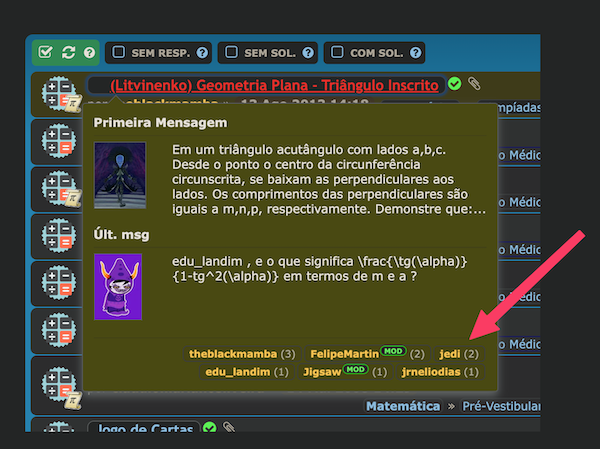

# Preview Who Posted - phpBB Extension

Adds "who posted" badges to the [Topic Preview](https://github.com/iMattPro/topic_preview) popup tooltip in phpBB forums.

When hovering over a topic title, the preview popup will show small badges at the bottom with the usernames of all users who posted in that topic, along with their post count.

## Screenshot



## Requirements

- phpBB 3.2.0 or later
- PHP 7.2 or later
- [Topic Preview](https://github.com/iMattPro/topic_preview) extension (vse/topicpreview) enabled

## Optional Extensions Support

The badges also appear in topic preview popups provided by:

- [Recent Topics](https://github.com/PayBas/RecentTopics) (paybas/recenttopics)
- [Precise Similar Topics](https://github.com/iMattPro/similartopics) (vse/similartopics)

These extensions are **not required** - the extension works without them.

## Installation

1. Download the [latest release](../../releases)
2. Extract the archive to `ext/profcaju/previewwhoposted/`
3. Go to ACP > Customise > Extensions
4. Find "Preview Who Posted" and click Enable
5. Purge the board cache

## How It Works

- Uses a single batch SQL query per page to fetch all posters for all visible topics (efficient, no N+1 queries)
- Hooks into the `vse.topicpreview.display_topic_preview` event to inject badges directly into the popup content
- Usernames are rendered via phpBB's `get_username_string()`, so they include profile links and user colours
- Badges are displayed with post count in parentheses, ordered by most posts first
- Limited to 10 posters per topic to keep the popup clean
- Includes DarkReader compatibility for dark mode

## File Structure

```
previewwhoposted/
├── composer.json
├── ext.php
├── license.txt
├── config/
│   └── services.yml
├── event/
│   └── listener.php
└── styles/
    └── all/
        ├── template/
        │   └── event/
        │       └── overall_footer_after.html
        └── theme/
            └── previewwhoposted.css
```

## License

[GNU General Public License v2](license.txt)
